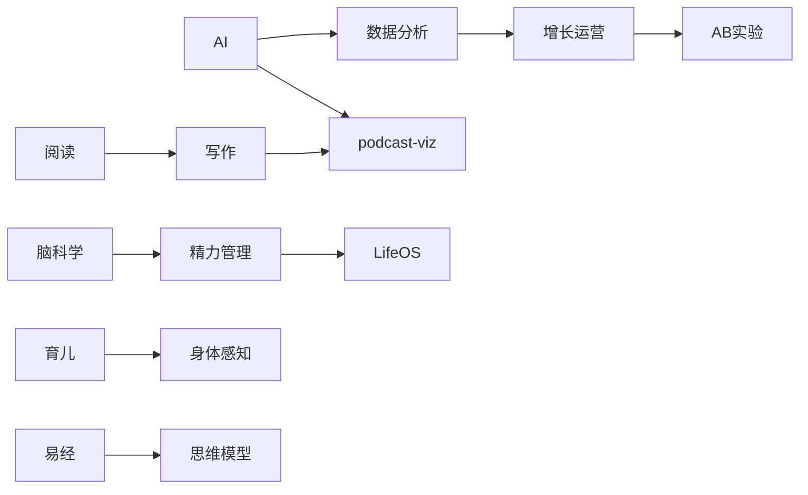

# 知识森林

> 跨领域关联能力是最稀缺的认知杠杆。

## 连接地图

```mermaid
graph LR
    AI --> 数据分析
    AI --> podcast-viz
    数据分析 --> 增长运营
    增长运营 --> AB实验
    脑科学 --> 精力管理
    精力管理 --> LifeOS
    阅读 --> 写作
    写作 --> podcast-viz
    育儿 --> 身体感知
    易经 --> 思维模型
```

## 跨域洞察记录

> 每次发现两个看似无关领域的意外连接时，记录在这里。
> 格式：`日期 | 领域A × 领域B | 洞察`

| 日期 | 连接 | 洞察 |
|------|------|------|
| | | |
